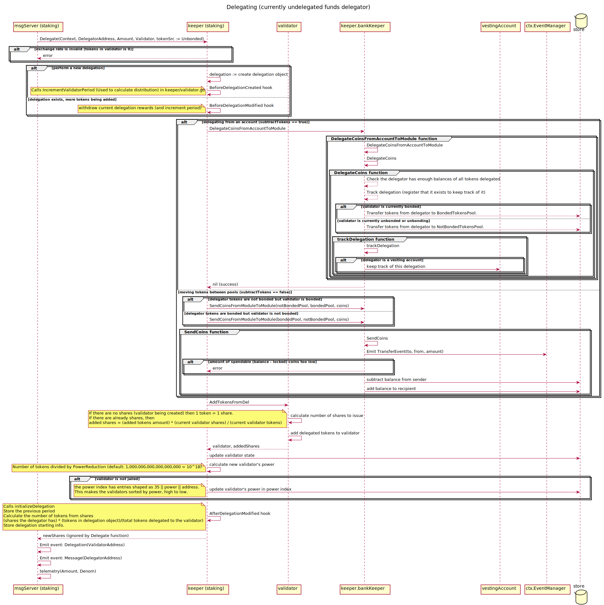
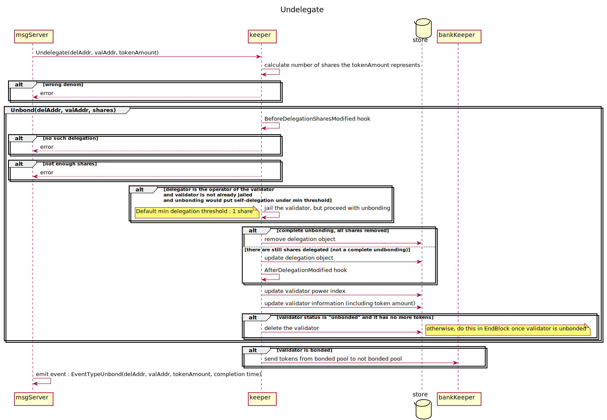
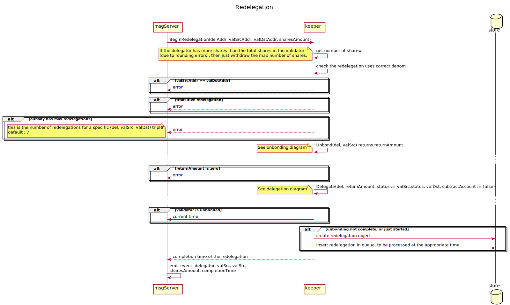

<!--
order: 3
-->

# Messages

In this section we describe the processing of the staking messages and the corresponding updates to the state. All created/modified state objects specified by each message are defined within the [state](./02_state_transitions.md) section.

## Msg/CreateValidator

A validator is created using the `Msg/CreateValidator` service message.
The validator must be created with an initial delegation from the operator.

+++ https://github.com/cosmos/cosmos-sdk/blob/v0.40.0/proto/cosmos/staking/v1beta1/tx.proto#L16-L17

+++ https://github.com/cosmos/cosmos-sdk/blob/v0.40.0/proto/cosmos/staking/v1beta1/tx.proto#L35-L51

This service message is expected to fail if:

- another validator with this operator address is already registered
- another validator with this pubkey is already registered
- the initial self-delegation tokens are of a denom not specified as the bonding denom
- the commission parameters are faulty, namely:
  - `MaxRate` is either > 1 or < 0
  - the initial `Rate` is either negative or > `MaxRate`
  - the initial `MaxChangeRate` is either negative or > `MaxRate`
- the description fields are too large

This service message creates and stores the `Validator` object at appropriate indexes.
Additionally a self-delegation is made with the initial tokens delegation
tokens `Delegation`. The validator always starts as unbonded but may be bonded
in the first end-block.

## Msg/EditValidator

The `Description`, `CommissionRate` of a validator can be updated using the
`Msg/EditValidator` service message.

+++ https://github.com/cosmos/cosmos-sdk/blob/v0.40.0/proto/cosmos/staking/v1beta1/tx.proto#L19-L20

+++ https://github.com/cosmos/cosmos-sdk/blob/v0.40.0/proto/cosmos/staking/v1beta1/tx.proto#L56-L76

This service message is expected to fail if:

- the initial `CommissionRate` is either negative or > `MaxRate`
- the `CommissionRate` has already been updated within the previous 24 hours
- the `CommissionRate` is > `MaxChangeRate`
- the description fields are too large

This service message stores the updated `Validator` object.

## Msg/Delegate

Within this service message the delegator provides coins, and in return receives
some amount of their validator's (newly created) delegator-shares that are
assigned to `Delegation.Shares`.

+++ https://github.com/cosmos/cosmos-sdk/blob/v0.40.0/proto/cosmos/staking/v1beta1/tx.proto#L22-L24

+++ https://github.com/cosmos/cosmos-sdk/blob/v0.40.0/proto/cosmos/staking/v1beta1/tx.proto#L81-L90

This service message is expected to fail if:

- the validator does not exist
- the `Amount` `Coin` has a denomination different than one defined by `params.BondDenom`
- the exchange rate is invalid, meaning the validator has no tokens (due to slashing) but there are outstanding shares
- the amount delegated is less than the minimum allowed delegation

If an existing `Delegation` object for provided addresses does not already
exist then it is created as part of this message otherwise the existing
`Delegation` is updated to include the newly received shares.

The delegator receives newly minted shares at the current exchange rate.
The exchange rate is the number of existing shares in the validator divided by
the number of currently delegated tokens.

The validator is updated in the `ValidatorByPower` index, and the delegation is
tracked in validator object in the `Validators` index.

It is possible to delegate to a jailed validator, the only difference being it
will not be added to the power index until it is unjailed.

## Msg/Undelegate

The `Msg/Undelegate` service message allows delegators to undelegate their tokens from
validator.

+++ https://github.com/cosmos/cosmos-sdk/blob/v0.40.0/proto/cosmos/staking/v1beta1/tx.proto#L30-L32

+++ https://github.com/cosmos/cosmos-sdk/blob/v0.40.0/proto/cosmos/staking/v1beta1/tx.proto#L112-L121

This service message returns a response containing the completion time of the undelegation:

+++ https://github.com/cosmos/cosmos-sdk/blob/v0.40.0/proto/cosmos/staking/v1beta1/tx.proto#L123-L126

This service message is expected to fail if:

- the delegation doesn't exist
- the validator doesn't exist
- the delegation has less shares than the ones worth of `Amount`
- existing `UnbondingDelegation` has maximum entries as defined by `params.MaxEntries`
- the `Amount` has a denomination different than one defined by `params.BondDenom`

When this service message is processed the following actions occur:

- validator's `DelegatorShares` and the delegation's `Shares` are both reduced by the message `SharesAmount`
- calculate the token worth of the shares remove that amount tokens held within the validator
- with those removed tokens, if the validator is:
  - `Bonded` - add them to an entry in `UnbondingDelegation` (create `UnbondingDelegation` if it doesn't exist) with a completion time a full unbonding period from the current time. Update pool shares to reduce BondedTokens and increase NotBondedTokens by token worth of the shares.
  - `Unbonding` - add them to an entry in `UnbondingDelegation` (create `UnbondingDelegation` if it doesn't exist) with the same completion time as the validator (`UnbondingMinTime`).
  - `Unbonded` - then send the coins the message `DelegatorAddr`
- if there are no more `Shares` in the delegation, then the delegation object is removed from the store
  - under this situation if the delegation is the validator's self-delegation then also jail the validator.

## Msg/BeginRedelegate

The redelegation command allows delegators to instantly switch validators. Once
the unbonding period has passed, the redelegation is automatically completed in
the EndBlocker.

+++ https://github.com/cosmos/cosmos-sdk/blob/v0.40.0/proto/cosmos/staking/v1beta1/tx.proto#L26-L28

+++ https://github.com/cosmos/cosmos-sdk/blob/v0.40.0/proto/cosmos/staking/v1beta1/tx.proto#L95-L105

This service message returns a response containing the completion time of the redelegation:

+++ https://github.com/cosmos/cosmos-sdk/blob/v0.40.0/proto/cosmos/staking/v1beta1/tx.proto#L107-L110

This service message is expected to fail if:

- the delegation doesn't exist
- the source or destination validators don't exist
- the delegation has less shares than the ones worth of `Amount`
- the source validator has a receiving redelegation which is not matured (aka. the redelegation may be transitive)
- existing `Redelegation` has maximum entries as defined by `params.MaxEntries`
- the `Amount` `Coin` has a denomination different than one defined by `params.BondDenom`

When this service message is processed the following actions occur:

- the source validator's `DelegatorShares` and the delegations `Shares` are both reduced by the message `SharesAmount`
- calculate the token worth of the shares remove that amount tokens held within the source validator.
- if the source validator is:
  - `Bonded` - add an entry to the `Redelegation` (create `Redelegation` if it doesn't exist) with a completion time a full unbonding period from the current time. Update pool shares to reduce BondedTokens and increase NotBondedTokens by token worth of the shares (this may be effectively reversed in the next step however).
  - `Unbonding` - add an entry to the `Redelegation` (create `Redelegation` if it doesn't exist) with the same completion time as the validator (`UnbondingMinTime`).
  - `Unbonded` - no action required in this step
- Delegate the token worth to the destination validator, possibly moving tokens back to the bonded state.
- if there are no more `Shares` in the source delegation, then the source delegation object is removed from the store
  - under this situation if the delegation is the validator's self-delegation then also jail the validator.

